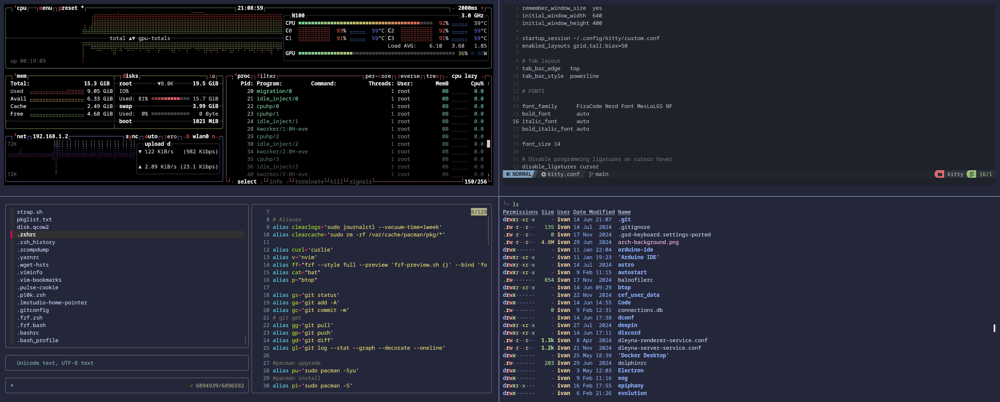

# Dotfiles

## What are dotfiles?

Dotfiles are configuration files in Unix-like operating systems that begin with a dot (.) character, making them hidden by default in directory listings. These files typically store preferences and settings for various command-line tools and applications.

## How I Use My Dotfiles

I keep my dotfiles in this repository to:

- Synchronize my development environment across multiple machines
- Track changes to my configurations over time
- Quickly set up my preferred environment on new systems
- Share my setup with others who might find it useful

## Packages required

- btop: replacement for htop and top tools;
- bat: replacement for cat command;
- eza: replacement for ls command;
- FZF: fuzzy finder;

### Screen Kitty with my configuration

